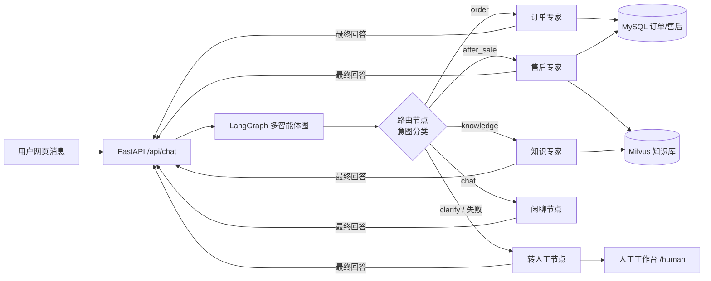

# 电商智能客服 Agent

基于 **FastAPI + LangGraph** 的可上线智能客服系统：自动识别用户意图，
分派给订单、售后、知识问答等专家 Agent 处理；结构化数据走 MySQL 工具精确查询，
商品与政策知识走 Milvus 向量检索（RAG）；高风险场景（退款超阈值、连续无法解决、
用户要求人工）由确定性规则触发转人工，并携带完整上下文生成工单。

系统内置 16 用例回归评测体系与可观测日志（节点级 + 工具级），
可通过 Docker Compose 一键部署（MySQL + Milvus + 应用）。

## 功能特性

- **LangGraph 多智能体编排**：显式路由节点 + 专家节点 + 共享状态，
  意图扩展只需新增节点与边，不影响既有分支；
- **工具化数据访问**：订单/物流/售后通过 SQLAlchemy 工具查询，
  禁止模型凭记忆编造业务数据；查无记录时如实反馈；
- **RAG 知识问答**：知识文档向量化入库 Milvus，回答基于检索结果并注明来源，
  降低开放域幻觉；
- **确定性风控规则**：退款金额超阈值由代码级校验强制转人工，
  不依赖模型提示词自觉（评测中曾复现“模型只说不做”）；
- **转人工流程**：三种触发场景（连续失败计数 / 退款超阈值 / 用户主动要求）
  统一打包会话 ID、意图、槽位与最近对话到工单，工单存 Redis（TTL 30 天），
  人工工作台实时查看，服务重启不丢工单；
- **限流与登录安全**：聊天按用户/IP 限流（默认 20 次/分钟）、注册登录按 IP 限流
  （10 次/分钟），连续 5 次登录失败锁定 5 分钟，超限统一返回 429；
- **回归评测体系**：17 用例覆盖订单/知识/售后/转人工/边界场景（含订单号格式回归），
  支持 `--rounds 3` 多轮稳定性验证；当前基线 48/48 通过（完成率 100%、
  轨迹正确率 100%，单轮平均约 ¥0.01）；
- **全链路日志**：路由意图、节点进出、工具名称/参数/返回/耗时均落日志，
  可复盘与定位；
- **用户体系与 Redis 会话缓存**：注册/登录（加盐哈希存密码 + 令牌鉴权），
  聊天记录与连续失败计数存 Redis（TTL 7 天），刷新页面、重启服务、
  多 worker 部署都不会丢失历史，多用户会话互相隔离；
- **容器化交付**：Dockerfile + docker-compose.yml 一键拉起
  MySQL、Milvus、Redis、应用，数据库端口不对外暴露，数据落命名卷。

## 系统架构



## 核心设计决策

1. **为什么用路由节点而不是“一个全能 Agent + 长提示词”**：
   每个专家只持有本职工具子集，降低工具误选率；业务规则（退款阈值、
   运输中不可退）可以挂到具体分支；轨迹可按节点复盘。
2. **为什么结构化数据走工具、知识走 RAG**：订单状态是精确、动态的事实，
   SQL 查询可信可解释；商品/政策是开放知识，靠向量召回 + 生成。
3. **为什么硬规则用代码兜底**：评测发现模型即使查到 ¥2999，
   仍可能在提示词要求下调工具失败；售后节点改为读取工具返回、
   金额超阈值即强制改道转人工，规则不再依赖模型随机性。
4. **为什么评测先于优化**：所有改动以 16 用例回归结果为验收标准，
   一次只改一个变量，指标未提升即回滚。

## 技术栈

| 层 | 选型 | 用途 |
|---|---|---|
| 编排 | LangGraph 1.x | 路由 + 专家节点 + 显式状态 + 条件边 |
| 大模型 | 通义千问 qwen-plus（OpenAI 兼容接口） | 路由分类 / 工具调用 / 回答生成 |
| 向量模型 | text-embedding-v3（HTTP 原生接口，自动分批） | 知识向量化 |
| 后端 | FastAPI + uvicorn | REST API + 静态页面 |
| 结构化数据 | MySQL 8 + SQLAlchemy 2 + PyMySQL | 订单 / 物流 / 售后单 |
| 向量库 | Milvus 3.0（standalone + embedded etcd） | 知识文档检索 |
| 前端 | 原生 HTML/JS | 客服聊天页 + 人工工作台 |
| 评测 | 自建脚本（`eval/run_eval.py`） | 完成率 / 轨迹 / 耗时 / 成本 |
| 部署 | Docker + Docker Compose | 一键编排三服务 |

## 目录结构

```text
customer-service-agent/
├─ app/
│  ├─ agents/         # 路由节点、专家节点、转人工节点、提示词
│  ├─ rag/            # 知识入库、在线检索、轻量向量客户端
│  ├─ tools.py        # 工具层（查订单/物流/售后/知识库/转人工）
│  ├─ graph.py        # LangGraph 图组装
│  ├─ state.py        # 图状态定义
│  ├─ memory.py       # 匿名会话内存存储（工单仓库）
│  ├─ store.py        # Redis：用户账号 / 令牌 / 聊天记录 / 失败计数
│  ├─ models.py       # MySQL ORM 模型
│  └─ main.py         # FastAPI 入口
├─ data/knowledge/    # 知识文档（商品、售后政策、物流规则）
├─ eval/              # 评测用例 + 跑分脚本
├─ static/            # 客服页 / 人工工作台
├─ Dockerfile
└─ docker-compose.yml
```

## 快速开始

> 想按“从零到一”的顺序理解整个项目，看 [docs/walkthrough.md](docs/walkthrough.md)：
> 每一步的为什么、关键代码、验证方式与踩坑记录。

### 本地开发

```powershell
# 1. 配置 .env（复制 .env.example，填入 DASHSCOPE_API_KEY）
# 2. 初始化演示数据与知识库（可重复执行，幂等）
python -m app.seed_data
python -m app.rag.indexer

# 3. 启动服务
python -m uvicorn app.main:app --port 8000
```

### Docker 部署

```powershell
docker compose build app
docker compose up -d mysql milvus redis
docker compose run --rm app python -m app.seed_data
docker compose run --rm app python -m app.rag.indexer
docker compose up -d app
```

- 客服页面：<http://127.0.0.1:8010>
- 人工工作台：<http://127.0.0.1:8010/human>
- 健康检查：`GET /health`
- 工单接口：`GET /api/handoffs`
- 用户接口：`POST /api/register`、`POST /api/login`、`POST /api/logout`
- 历史接口：`GET /api/history?token=...`

MySQL / Milvus 端口不映射宿主机，仅容器内部网络互通，避免与本机服务冲突
（Redis 仅映射到本机 6381，方便本地调试）；
数据持久化于命名卷，`docker compose down` 不丢数据。

## 评测

```powershell
python -m eval.run_eval              # 单轮全量
python -m eval.run_eval --rounds 3   # 多轮稳定性模式
python -m eval.run_eval --case refund-threshold-high
```

输出：任务完成率 / 轨迹正确率 / 平均耗时 / 估算成本，结果写入 `eval/report.json`；
多轮模式会列出通过率 < 100% 的不稳定用例及失败原因。

## API 示例

```bash
curl -X POST http://127.0.0.1:8010/api/chat \
  -H "Content-Type: application/json" \
  -d '{"session_id":"demo","message":"帮我查一下订单20260901001到哪了"}'
```

## 扩展方向

- 会话记忆持久化（Redis / 数据库），支持多实例水平扩展；
- 接入真实订单 / CRM 系统与消息队列；
- 模型按节点差异化选型（路由用低成本模型，专家用强模型）；
- LLM-as-judge 开放题评分，扩充评测维度。
